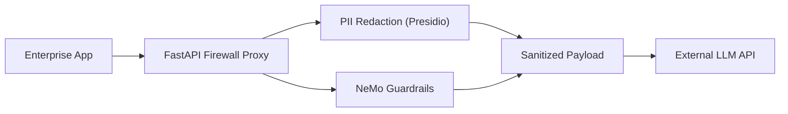

# Enterprise Agent Firewall & Guardrails 🛡️

A robust proxy layer that sits between your enterprise applications and external LLM APIs (OpenAI, Anthropic). Ensures SOC2/GDPR compliance by automatically redacting PII and blocking prompt injection attacks.

## 🎯 Business Value
- **Data Security:** Zero-trust architecture ensures no customer PII ever leaves your VPC.
- **Compliance:** Built-in auditing and GDPR-compliant data masking using Microsoft Presidio.
- **Brand Protection:** NeMo Guardrails prevents the AI from discussing competitors, politics, or going off-topic.

## 🏗️ System Architecture



## 🛠️ Tech Stack
- **Core:** Python 3.11, FastAPI
- **Security:** Microsoft Presidio (PII), NVIDIA NeMo Guardrails
- **Infrastructure:** Docker

## 🚀 Quick Start
```bash
docker-compose up --build
```

## Connect with Me

- **Portfolio:** [kishjandeepyonghang.me](https://kishjandeepyonghang.me)
- **LinkedIn:** [Kishjan Deep Yonghang](https://www.linkedin.com/in/kishjan-yonghang-b6a324430/)
- **Facebook:** [Kishjan Deep Yonghang](https://www.facebook.com/profile.php?id=61575446859939)
- **WhatsApp:** [+977-9815972075](https://wa.me/9779815972075)
- **Email:** yonghangkishjan608@gmail.com

